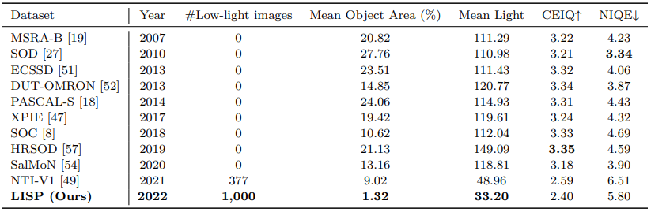
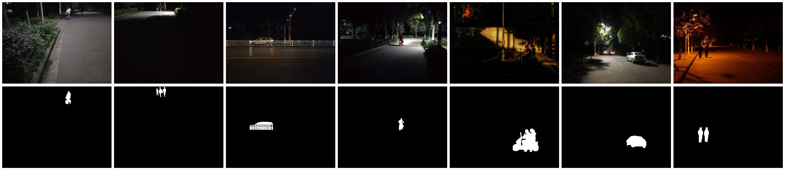
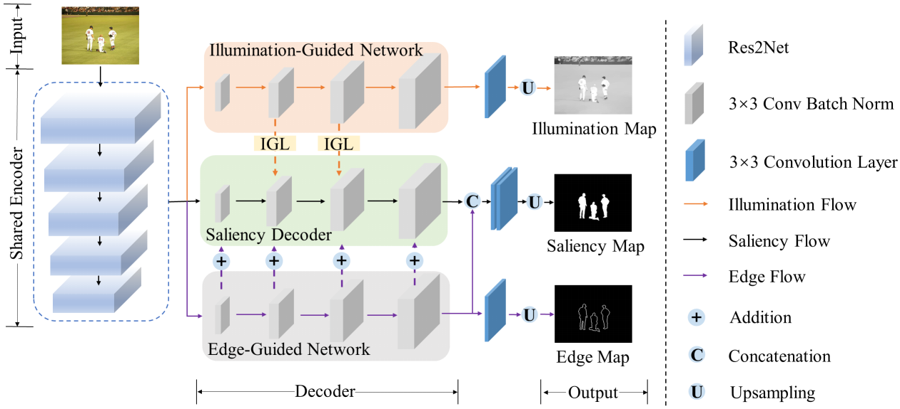
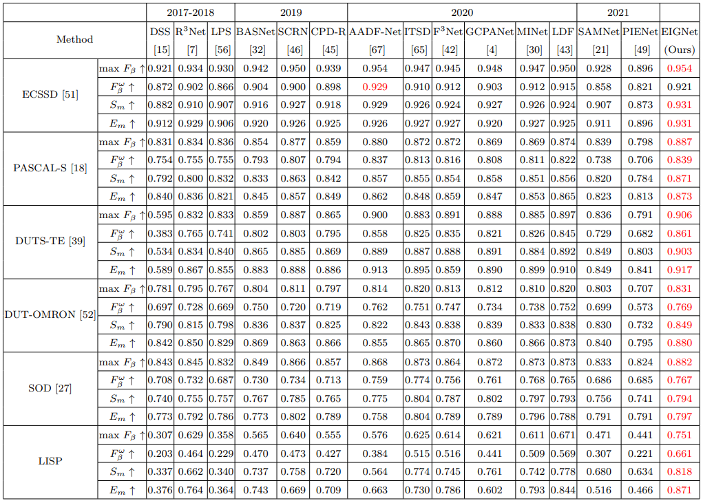
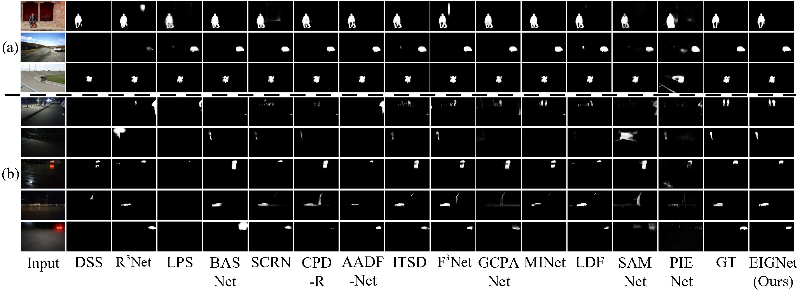

## Catching Small Persons/Vehicles in Low Light: A New SOD Benchmark
by Xin Xu, Shiqin Wang, Zheng Wang, Chia-Wen Lin, Meng Wang

## Low lIght Salient Person/vehicle (LISP) dataset
- Recent years have witnessed rapid progress if Salient Object Detection (SOD). However, relatively few efforts have been dedicated to modeling salient object detection in low-light scenes with small persons/vehicles. Furthmore, realistic applications of salient person/vehicle detection at long distances in low-light environments commonly exist in nighttime surveillance and nighttime autonomous driving. In particular, for autonomous driving at night, detecting people/vehicles with high reliability is paramount for safety. To fill the gap, we elaborately collect a new Low lIght Salient Person/vehicle (LISP) dataset, which consists of 1,000 high-resolution images containing low-light small persons/vehicles, and covers diverse challenging cases (e.g., low-light, non-uniform illumination environment, and small objects).

- You can download LISP [Google](https://drive.google.com/file/d/1tBSHzgA7rYupGAO7ZY2jhkErjCWJdEbo/view?usp=sharing) | [Baidu 提取码:wqjv](https://pan.baidu.com/s/1SC3CkgT0wIz-jGW_Ddur5A) now. The LISP dataset is for academic use only. By downloading the dataset, you guarantee that you will use this dataset for academic work only.

- Comparison of LISP with existing SOD datasets 



- Representative images and corresponding ground-truth masks in the LISP dataset



## Introduction
 Architecture of Edge and Illumination-Guided Network (EIGNet). It consists of an encoder and three decoders, i.e., a Shared Encoder for feature extraction, an Illumination-Guided Network (IGN), a Saliency Decoder, and an Edge-Guided Network (EGN). The latter three decoders generate the Illumination Map, Saliency Map, and Edge Map, respectively. The decoder progressively integrates IGN and EGN to guide the Saliency Decoder to generate saliency maps in a supervised manner. Among them, IGN applies the Illumination Guidance Layer (IGL) to augment salient features with illumination features.

## Prerequisites
- [Python 3.5](https://www.python.org/)
- [Pytorch 1.3.1](http://pytorch.org/)
- [OpenCV 4.4.0.42](https://opencv.org/)
- [Numpy 1.16.2](https://numpy.org/)
- [TensorboardX 2.1](https://github.com/lanpa/tensorboardX)
- [Apex](https://github.com/NVIDIA/apex)


## Clone repository
```shell
git clone https://github.com/Angelina8120/Low-light-Small-SOD-baseline.git
cd Low-light-Small-SOD-baseline/
```

## Download dataset
Download the following datasets and unzip them into `data` folder

Most of the existing RGB datasets contain multi-scale salient object images, but a large-scale dataset particularly designed for addressing small SOD problems is still missing. To address this issue, we propose a Zoom Out Salient Object (ZOSO) strategy to generate a synthetic normal-light small object (small DUTS-TR) dataset for training.
- small DUTS-TR: [Google](https://drive.google.com/file/d/1J9ljG9nRq-7_QMelr4jESv6JG1LuCsKb/view?usp=sharing) | [Baidu 提取码:6x03](https://pan.baidu.com/s/1fijnp69Ehq4lZYETbNkinQ)

We conduct experiments on our proposed LISP dataset and five widely used datasets, ECSSD, PASCAL-S, DUTS, DUT-OMRON, and SOD.
- LISP: [Google](https://drive.google.com/file/d/1tBSHzgA7rYupGAO7ZY2jhkErjCWJdEbo/view?usp=sharing) | [Baidu 提取码:wqjv](https://pan.baidu.com/s/1SC3CkgT0wIz-jGW_Ddur5A)
- [ECSSD](http://www.cse.cuhk.edu.hk/leojia/projects/hsaliency/dataset.html)
- [PASCAL-S](http://cbi.gatech.edu/salobj/)
- [DUT-OMRON](http://saliencydetection.net/dut-omron/)
- [SOD](https://elderlab.yorku.ca/SOD/SOD.zip)
- DUTS: [Google](https://drive.google.com/file/d/1ivK2BCJN8B9UkX_Psf4WF5UcCyxFsTi3/view?usp=sharing) | [Baidu 提取码:ak5t](https://pan.baidu.com/s/1l5UIQYVNRDAX9qg-T09R-g)

Morever, to validate the importance of LISP and the effectiveness of EIGNet for real low-light scenes, we randomly select 500 images from LISP as the training set (LISP-Train), and the other 500 images as the testing set (LISP-Test).
- LISP_Train: [Google](https://drive.google.com/file/d/1alvUDlFb1EZmjKn-2nsh7k2kaAGaVsx6/view?usp=sharing) | [Baidu 提取码:9wla](https://pan.baidu.com/s/1JZkTtFmwxoz9w84FiPvESw)
- LISP_Test: [Google](https://drive.google.com/file/d/1nuClRGlo8iWwWoYvTWuYfCAilb9BM0II/view?usp=sharing) | [Baidu 提取码:qlap](https://pan.baidu.com/s/1J3bZY7Nn5rwejR3c4hSgBg)

## Training & Evaluation
- If you want to train the model by yourself, please download the [pretrained model] [Google](https://drive.google.com/drive/folders/14QQFMmppB8T62gsS04vUwq5FLQWTUusq?usp=sharing) | [Baidu 提取码:1d17](https://pan.baidu.com/s/1XYtdFvMl8-YZXgdrqQGBMA) into `res` folder
- We obtain the illumination map from image, and the edge map from the ground truth.
```shell
    python train.py
```
- Predict the saliency maps
```shell
    python test.py
```
- Evaluate the predicted results. 
```shell
    cd eval
    matlab
    main
```

## Testing & Evaluate
- If you just want to evaluate the performance of EIGNet without training, please download our trained model and unzip trained model. Note that the model in 'out(DUTS)', 'out(LISP_Train)', and 'out(small DUTS-TR)' folder is trained by DUTS-TR, LISP_Train, and small DUTS-TR dataset respectively.

- Predict the saliency maps
```shell
    python test.py
```
- Evaluate the predicted results
```shell
    cd eval
    matlab
    main
```

## Saliency maps & Trained model
- saliency maps: [Google](https://drive.google.com/file/d/18NPhoQhNw38kxDdjB3A6yQ5SHqbng_EN/view?usp=sharing) | [Baidu 提取码:afw8](https://pan.baidu.com/s/1-c_RhSuPS4g0aVmX3AAdAg)
- trained model: [Google](https://drive.google.com/file/d/1SSGN-tTU-zzgwpIwh1NJfpqTBdnQqhZl/view?usp=sharing) | [Baidu 提取码:bges](https://pan.baidu.com/s/1pMzeEHx_cKE8udrCvGyahg)

- Quantitative comparisons 



- Qualitative comparisons 



- If you have any questions about the LISP dataset and EIGNet, please contact wangshiqin@wust.edu.cn

## Citation
- If you find this work is helpful, please cite our paper
```
@InProceedings{xu2022catching,
    author    = {Xu, Xin and Wang, Shiqin and Wang, Zheng and Lin, Chia-Wen and Wang, Meng},
    title     = {Catching Small Persons/Vehicles in Low Light: A New SOD Benchmark},
    journal = {},
    year      = {2022}
}
```
